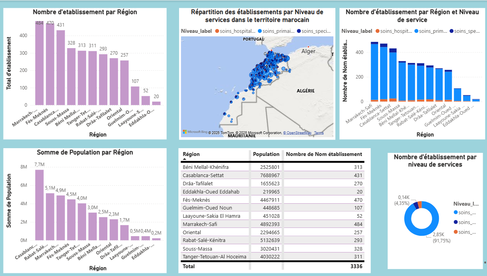

# Healthcare-Facilities-Distribution-in-Morocco

Analysis and visualization of public healthcare facilities distribution in Morocco using **Power BI** and **Python (Jupyter Notebook)**.  
Includes population comparison, service levels, and geospatial insights.

---

##  Project Overview
This project analyzes and visualizes the distribution of public healthcare facilities in Morocco.  
The main objectives are:
- Compare the number and capacity of healthcare establishments with **population distribution**.  
- Evaluate the **quality of services offered** (availability of hospitals, specialties, etc.).  
- Provide **geospatial insights** into regional disparities.

---

##  Features
- **Healthcare KPIs**: Metrics on the number of establishments, capacity, and service levels.  
- **Geospatial Visualizations**: Mapping of facilities using latitude/longitude across Moroccan regions.  
- **Population Comparison**: Ratio of population per facility using HCP 2024 data.  
- **Feature Engineering**: Service-level classification based on facility category.  
- **Data Cleaning**: Handling duplicates, missing values, and consistency across datasets (2020 & 2022).  
- **Dashboard**: Interactive **Power BI** dashboards exploring capacity, quality, and regional disparities.  

---

##  Technologies Used
- **Power BI** → Data visualization & dashboarding  
- **DAX** → Custom metrics & calculated fields  
- **Power Query** → ETL (Extract, Transform, Load)  
- **Python (Jupyter Notebook)** → Data cleaning, feature engineering, geocoding  
- **Excel** → Source files (data.gov.ma, HCP population data)  

---

## Dashboard Overview
The Power BI dashboard provides:
- **KPIs**: Establishments, capacity, service levels  
- **Maps**: Geographic distribution across regions  
- **Comparisons**: Population vs. facilities per region  
- **Charts**: Regional breakdown by healthcare category  

---

##  ETL Process
**Extract**: Import healthcare data (2020 & 2022) and HCP population data (2024).  
**Transform**: Rename columns, merge datasets, check duplicates/missing values.  
**Feature Engineering**: Create service-level & geographic columns.  
**Load**: Cleaned data into Power BI.  

---

##  DAX Calculations
- **Total Facilities** → Count of establishments by region  
- **Capacity Ratios** → Population per facility  
- **Quality Index** → Proxy indicators based on facility category & services  

---

## Key Insights
1. **Regions with most facilities**  
   - Marrakech-Safi → 484 facilities / 4.4M inhabitants  
   - Fès-Meknès → 470 facilities / 4.5M  
   - Casablanca-Settat → 431 facilities / 7.7M  
   ✅ Casablanca is **under-equipped** compared to its population.  

2. **Under-equipped regions**  
   - Eddakhla-Oued Eddahab → 219K people / 20 facilities (~11K per facility)  
   - Laâyoune-Sakia El Hamra → 451K / 52 facilities (~8.6K per facility)  
   - Guelmim-Oued Noun → 448K / 107 facilities (~4.1K per facility)  
   ✅ Some small regions are **better equipped** than highly populated ones.  

3. **Distribution by service level**  
   - Hospital care → 91.75%  
   - Primary care → 4.35%  
   - Specialized care → ~3.9%  
   ⚠️ Strong imbalance: very few primary/specialized care structures.  

4. **Geographic distribution**  
   - Strong concentration in **Northwest regions** (Casablanca, Rabat, Tangier, Fès).  
   - Sparse equipment in **southern & rural areas**.  

---

## 🎯 Strategic Recommendations
- Reinforce **Casablanca-Settat**: urgent due to high population-to-facility ratio.  
- Strengthen **primary & specialized care**: >90% of facilities are hospital-focused.  
- Maintain efforts in **southern regions**: preserve good ratios.  
- Improve **territorial equity**: mobile units, teleconsultation, small centers.  

---

## 📑 Regional Comparison

| Region                  | Population | Facilities | Inhabitants/Facility |
|--------------------------|------------|------------|-----------------------|
| Casablanca-Settat        | 7.7M       | 431        | 17,846                |
| Fès-Meknès               | 4.5M       | 470        | 9,574                 |
| Marrakech-Safi           | 4.4M       | 484        | 9,090                 |
| Guelmim-Oued Noun        | 448K       | 107        | 4,193                 |
| Eddakhla-Oued Eddahab    | 219K       | 20         | 11,000                |

---

## ⚙️ Installation
1. Clone this repository to your local machine.
2. Open the Power BI file (.pbix) in Power BI Desktop.
3. Update data sources if necessary (see README_data.md for instructions to obtain raw data).
4. Refresh the data and explore the dashboard.

   ---

   ## Screenshots

   ---

## License
This project is licensed under the Apache License - see the LICENSE file for details.

   ---

## Acknowledgements
- [Power BI Documentation](https://learn.microsoft.com/en-us/power-bi/)  
- [DAX Documentation](https://learn.microsoft.com/en-us/dax/)  
- [Power Query Documentation](https://learn.microsoft.com/en-us/power-query/)  
- [data.gov.ma](https://www.data.gov.ma/)  
- [HCP Morocco](https://www.hcp.ma/) 

 
   
